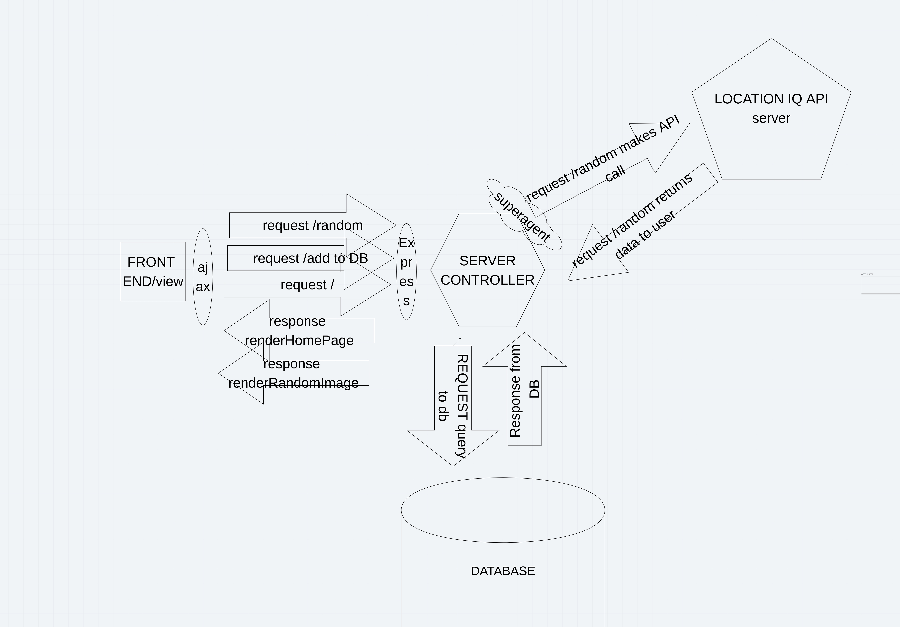
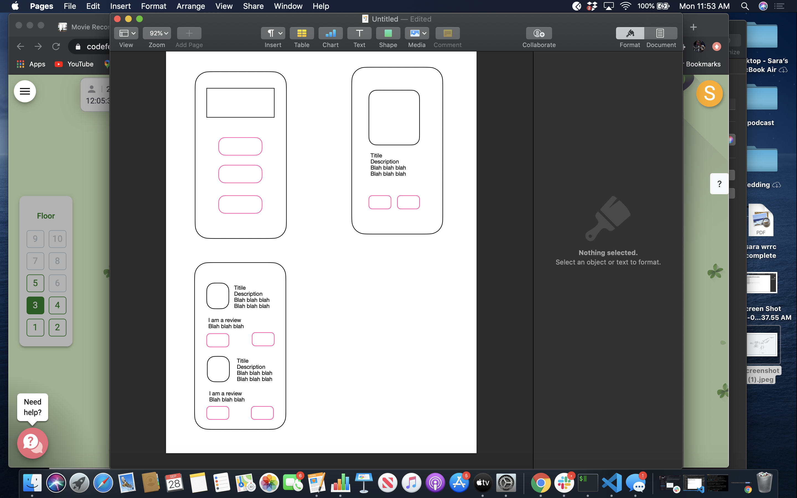

# movie-recommender

Saturday September 26th
pre-work feature: set up server
estimated time to complete 1hr
start time 5:55pm
end time 6:20pm
actual total time 25 minutes

prework feature: set up database
estimated time to complete 30 min
start time 7:30pm
end time 7:55pm
actual total time 25min

prework feature: create ejs framework and header/footer partials
estimated time to complete 1 hr
start time 8:00pm
end time 8:23pm
actual total time 23 min

feature 1 - random christmas movie generator
eatimated time to complete 2 hours
start time 8:30pm 
end time 9:00pm
start time 11:00pm
end time 12:00am
actual total time 1 hr 30 min

Sunday September 27th

## User Stories

### As a mom, I want to be able to search for family-friendly movies, so that I can watch with my kids. 

Feature Tasks:
- User can search by keyword.
- Up to 15 results are displayed onscreen.
- User can add recommend movie(s) to others.

Acceptance Tests:
- Ensure keywords are accurate and valid. 
- Ensure functionality of saving to recommended list. 
- Provide error message if there are no results.
- Provide default if no information is returned from API. 

## As a busy millenial, I want to save time and effort by seeing recommended movies, so that I can make a decision faster.

Feature Tasks:
- User can view movies recommended by others. 
- Website renders quickly and efficiently.
- User can delete movies from recommendation list.
- User can update the list by adding their own recommended movie or writing a review.

Acceptance Tests:
- Ensure data is organized and API calls are efficient to render the page quickly.
- Ensure movies successfully save into the database.
- Ensure the user interface is intuitive so users can easily utilize this app. 

## As a user, I want to see a randomly generated movie, so that I can find a new movie that I've never heard of before. 

Feature Tasks:
- Show one random movie from a sample array.
- Allow user to see a new random movie. 
- Allow user to recommend a randomly-generated movie.

Acceptance Tests:
- Ensure that random movies are not repeated.
- Select a sample size that allows a good variety of random movies.

## As a user, I want to see holiday-specific movies, so that I can enjoy the season. 

Feature Tasks:
- Create an app that is responsive to current season: 4 seasons/themes total.
  - Movies change theme based on season.
  - User interface reflects the current season. 

Acceptance Tests:
- App responds to current date and renders/functions accordingly.
- Default to Christmas in case of error or if date is unavailable. 

## As a movie connoiseur, I want to add movies to a list, so that I can share my my recommendations with others. 

Feature Tasks:
- Allows users to recommend movies they have seen.
- Allows users to delete movies from recommendation list.
- Allows users to add a review to recommended movies.

Acceptance Tests:
- Ensure user can add their name to their review.
- Add character limit to all reviews. 

# Domain Modeling

# Entity Relationship Diagram

